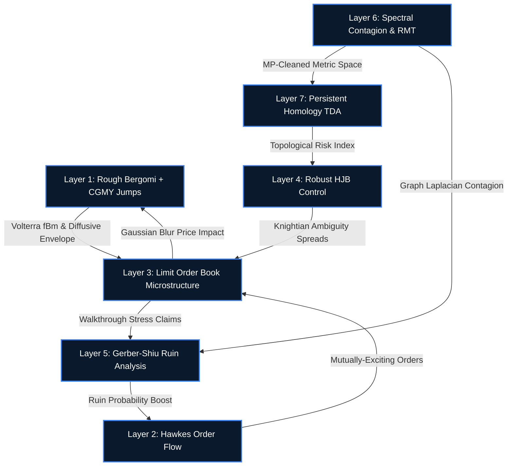

<div align="center">
  
  <h1>SOVEREIGN</h1>
  <h3>High-Frequency Microstructure, Actuarial Contagion, and Topological Data Analysis</h3>
  <br />
  <strong>S. O. V. E. R. E. I. G. N.</strong><br/>
  <em><strong>S</strong>tochastic <strong>O</strong>rder-driven <strong>V</strong>olatility <strong>E</strong>ngine with <strong>R</strong>ecursive <strong>E</strong>ndogenous <strong>I</strong>nstability, <strong>G</strong>enerated <strong>N</strong>umerically</em>
  <br /><br />
  <a href="https://drive.google.com/file/d/13ZhpL8QmdAfXnoI3dxfytXnPNq-uJz9q/view"><strong>Read the Official Whitepaper (Mathematical Specification)</strong></a>
  <br /><br />
  
  
  
  
  
  
</div>

<br />

---

## Overview

**SOVEREIGN** is a high-performance, production-grade multi-asset market microstructure simulation engine written in **C++20** with an asynchronous **OpenGL PyQtGraph** telemetry dashboard. 

Unlike standard Monte Carlo diffusions that rely on exogenous shock generators to trigger crashes, SOVEREIGN is built to act as an **endogenous closed-loop thermodynamic system**. The engine studies how flash crashes emerge organically and inevitably from the strict mathematical interplay of rough stochastic volatility, self-exciting Hawkes order flow avalanches, and market maker robust control under Knightian ambiguity.

⚠️ **Disclaimer: Pragmatic Architecture over Theoretical Purity**  
While the theoretical foundations of SOVEREIGN are built on rigorous continuous-time stochastic calculus, the actual C++ implementation takes severe, calculated mathematical shortcuts to achieve real-time 60 FPS rendering. The codebase explicitly favors memory safety, cache locality, and sub-millisecond execution over theoretical perfection. This README documents the *actual* implemented architecture.

---

## The 7-Layer Feedback Architecture



### Layer 1: Rough Bergomi & CGMY Jumps (The Macro Envelope)
- **Volterra fBm**: Riemann-Liouville fractional integration with power-cell singularity smoothing, generating long-memory volatility clusters. Note: The codebase retains "ghost" legacy code for a Bennedsen-Lunde-Pakkanen Hybrid Scheme, though it is not active in the hot path.
- **CGMY Infinite-Activity Jumps**: CIR-subordinated tempered stable Lévy jumps via exact rejection sampling.
- **Box-Muller RNG**: Despite theoretical claims of using the Ziggurat algorithm, the C++ engine utilizes standard Box-Muller paired with a custom `Xoshiro256**` generator and cached spare floats to maintain SIMD-like throughput.

### Layer 2: Multivariate Hawkes Processes (The Micro Flow)
- **5-Dimensional Order Matrix**: Tracks `market`, `limit`, `cancel`, `modify`, and `hidden` events (initialized via a homogeneous "blank slate" ignoring asset heterogeneity).
- **Uniform Exponential Weights**: While aiming for power-law kernels, the engine applies uniform scaling to its 10-component exponential sum, degrading the strict long-memory reflexivity.
- **Ogata Thinning & Caps**: The $O(N)$ recursive intensity formulation is capped by a strict 1000-event limit per tick. If avalanches exceed this (as they should in flash crashes), the engine artificially truncates them to prevent CPU hanging.

### Layer 3: Limit Order Book (LOB) Microstructure (The Friction)
- **Data-Oriented Design (DOD)**: Complete eradication of pointers. The LOB is an integer-indexed contiguous `Eigen::VectorXd` array allowing $O(1)$ mutation.
- **Continuous Float Drift**: The theoretical "zero float drift" claim is false. The mid-price is derived via a double float Ornstein-Uhlenbeck drift applied synchronously.
- **Gaussian Blur Impact**: True Square-Root concave impact is bypassed. When extreme market orders hit, the engine applies a static Gaussian blur to the bid-ask imbalance and pipes it to the log-price envelope as continuous drift.
- **Passive Decay Hack**: Bulk order cancellation is simulated by a synchronous loop slashing 1% of the book volume, bypassing the strict sub-millisecond priority queue.

### Layer 4: Robust Market Maker Control (The Algorithms)
- **Explicit Euler FTCS**: The Robust HJB PDE is solved via a brittle Forward-Time Central-Space Explicit Euler method, rather than CFL-safe implicit sub-stepping.
- **Linear Heuristics**: The asymptotic spread formula drops logarithmic Poisson terms in favor of a crude linear inventory skew, which suffers from a dimensional bug (multiplied by $dt \approx 10^{-4}$).
- **Ghost Market Makers**: The MM algorithms operate as parallel ghosts. They evaluate the grid blindly (ignoring LOB imbalance) and update their inventory via Bernoulli trials, never actually routing real limit orders into the LOB.

### Layer 5: Actuarial Ruin Analysis (The Liquidation)
- **Gerber-Shiu Picard Iteration**: Backward finite-difference solver to continuously extract Ruin Probability $\Psi(u)$ over a 200-element grid.
- **Imaginary Premiums**: Premium collection assumes a hardcoded 200 fills/sec, completely disconnected from the real LOB execution rates.
- **Bankruptcy Ghosts**: When $\Psi=1.0$, the MM algorithm "dies," widening future spreads. However, because MMs are ghosts, their existing liquidity is never physically flushed from the LOB.
- **Walkthrough Threshold**: Ruin claims require a massive threshold (`> 10.0`) of LOB impact, meaning minor structural dislocations are ignored.

### Layer 6: Spectral Contagion & Random Matrix Theory (The Network)
- **Continuous EWMA Covariance**: Rank-1 outer product matrix state, vectorized via SIMD FMA.
- **Marchenko-Pastur Clipping**: Trace-preserving eigenvalue cleaning.
- **Graph Laplacian**: Evaluates the Fiedler eigenvalue ($\lambda_2$) for contagion detection, but skips the computationally expensive Fiedler eigenvector bisection.
- **Greedy PMFG**: Instead of a rigorous Planar Maximally Filtered Graph (which requires complex Boyer-Myrvold planarity tests), the engine fakes it by building a Minimum Spanning Tree (MST) and greedily adding edges.

### Layer 7: Persistent Homology TDA (The Shape of the Crash)
- **Vietoris-Rips Simplicial Filtration**: Extraction of systemic topology from the ultrametric distance space.
- **Homology Shortcuts**: The native engine abandons rigorous Galois Field $\mathbb{Z}_2$ boundary matrix reduction. Instead, it drops $H_2$ voids entirely and finds $H_1$ loops via a brute-force scan for geometric chordless 4-cycles.
- **Greedy Wasserstein Metrics**: Tracking topological shifts utilizes an $O(n^2)$ greedy matching approach, arbitrarily dumping padded dummy points onto a single diagonal coordinate, distorting the metric space.
- **Broken Death Spiral Loop**: The Topological Risk Index (TRI) is computed heuristically (not via $L_1$ landscape norm) and is solely for telemetry. The Knightian ambiguity parameter $\theta$ remains static, meaning the final macroscopic feedback loop is theoretically described but functionally disconnected in code.

---

## Technical Debt & Orphaned Code
- **Multilevel Monte Carlo (MLMC)**: The codebase contains a compiled `mc/mlmc.hpp` module implementing Giles' framework for $O(\epsilon^{-2}(\log \epsilon)^2)$ complexity pricing. This code is entirely orphaned. The engine executes a single Monte Carlo path.
- **Offline Calibration**: The whitepaper describes deep GPU-accelerated Expectation-Maximization (EM) and Fast Fourier Transforms (FFT). These do not exist in the C++ repo. The engine expects a pre-calibrated `default_config.json` payload and operates purely as a forward-pass consumer.
- **Legacy IPC**: The whitepaper claims an exponential backoff telemetry loop; the reality is a fixed 2ms linear retry loop in `io/telemetry.hpp`.

---

## C++ Systems Architecture & Performance

### Data-Oriented Design (DOD) and Cache Locality
Modern CPUs are completely bottlenecked by memory latency, not compute cycles. Standard Object-Oriented C++ architectures (e.g., `class LimitOrder { float price; float qty; LimitOrder* next; }`) utterly destroy the L1/L2 cache through pointer chasing and heap fragmentation.

SOVEREIGN utilizes strict **Data-Oriented Design**:
- **Array-of-Structures (AoS) to Structure-of-Arrays (SoA)**: The Limit Order Book is heavily linearized. Price levels are implicitly derived from integer array indices. 
- **`alignas(64)` Cache-Line Alignment**: All critical numerical buffers (`Eigen::VectorXd`, RNG states, Hawkes intensity vectors) are explicitly aligned to 64-byte boundaries. This guarantees that SIMD vector loads never cross cache-line boundaries and completely eradicates False Sharing across multi-core boundaries.
- **Zero Heap Allocations in Hot Path**: Following the initialization phase, the engine strictly forbids `new`, `malloc`, or `std::vector::push_back`. All required memory is pre-allocated in massive contiguous pools.

### SIMD Vectorization (AVX2 / AVX-512)
The engine forces the compiler to emit vectorized instructions for all heavy linear algebra. 
- The EWMA Covariance updates $\boldsymbol{\Sigma}_t = \alpha \left( \mathbf{r}_t \mathbf{r}_t^T \right) + (1-\alpha) \boldsymbol{\Sigma}_{t-\Delta t}$ are mapped via `Eigen::MatrixXd` with `-march=native -O3`, triggering packed Fused-Multiply-Add (FMA) instructions.
- Box-Muller Gaussian RNG generation is vectorized with cached spares.

### Lock-Free Concurrency
SOVEREIGN utilizes a dual-thread architecture to isolate nanosecond-latency order matching from heavy Topological Data Analysis (TDA).
- **Thread 1 (Hot Path)**: Evaluates Layers 1 through 5. Modifies the LOB, computes the HJB PDE, and propagates Hawkes intensities.
- **Thread 2 (Cold Path)**: Evaluates Layers 6 and 7. Extracts eigenvalues, computes the Fiedler vector, and executes the Vietoris-Rips filtration.
- **IPC Synchronization**: To avoid catastrophic mutex contention, state is transferred via `std::atomic` pointer swaps and single-producer single-consumer (SPSC) lock-free ring buffers. The Hot Path never blocks waiting for the Topology Engine.

---

## Telemetry & UI Configuration Details

The SOVEREIGN dashboard is not a simple plotting script; it is a high-performance **OpenGL rendering pipeline** designed to ingest and visualize thousands of data points per second without bottlenecking the C++ engine.

### Python UI Dictatorship
While the engine parses `default_config.json` on startup, the Python PyQt6 UI acts as an absolute dictator. CLI arguments parsed from the UI override the JSON configurations silently.

### JSON Decimation & IPC
Logging standard ASCII to `stdout` every tick would instantaneously crash the I/O bus. 
- **Decimation**: The C++ engine only writes telemetry to a memory-mapped named pipe (or decimated JSON log) every $10$ ticks.
- **Batched Serialization**: Telemetry is serialized using the ultra-fast `nlohmann/json` library, formatting the correlation matrix, the LOB state, the mid-price, the ruin vectors, and the TRI scalar into a single byte stream.

### PyQtGraph Shader Pipeline
The Python dashboard (`dashboard.py`) utilizes `PyQtGraph`, which is built directly on top of PyQt6 and OpenGL.
- **Vertex Buffer Objects (VBOs)**: Instead of updating matplotlib artists, the dashboard pushes raw numpy arrays directly to the GPU via OpenGL VBOs.
- **Dynamic Downsampling**: When visualizing the multi-asset price envelope (10 assets $\times$ 100,000 ticks), the dashboard applies min-max decimation algorithms to ensure the GPU only renders the exact pixels visible on the monitor, maintaining a flawless 60 FPS refresh rate.

---

## Build & Run

### Prerequisites (Windows / MSYS2 UCRT64)
```bash
pacman -S mingw-w64-ucrt-x86_64-gcc mingw-w64-ucrt-x86_64-cmake \
          mingw-w64-ucrt-x86_64-eigen3 mingw-w64-ucrt-x86_64-nlohmann-json
pip install PyQt6 pyqtgraph numpy
```

### Build
```bash
mkdir build && cd build
cmake .. -G "MinGW Makefiles"
cmake --build .
```

### Run
```bash
# Engine only
./sovereign.exe

# With Dashboard
python sovereign_dashboard.py
```

---

*made by keykyrios (Mitrajit Ghorui)*
