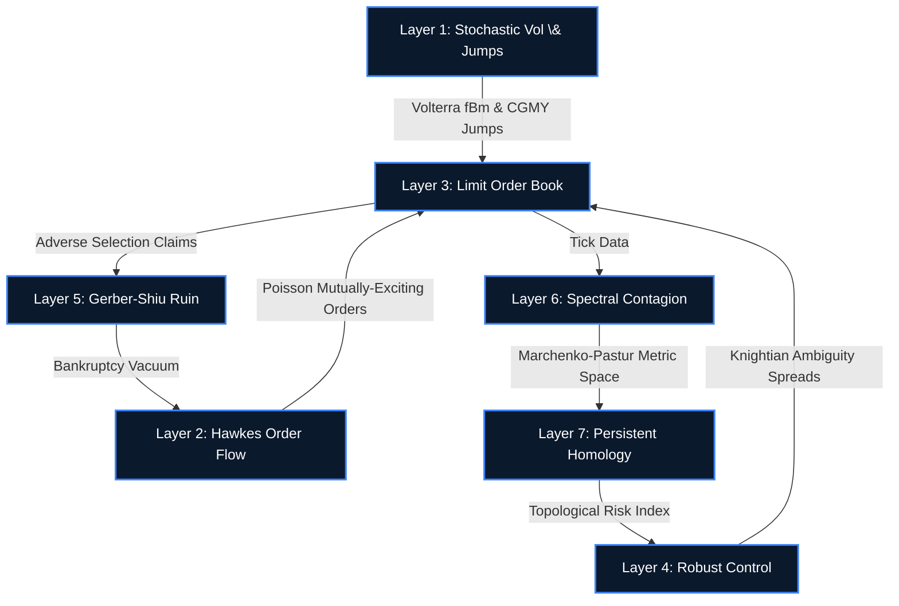

<div align="center">
  <h1>SOVEREIGN</h1>
  <h3>High-Frequency Microstructure, Actuarial Contagion, and Topological Data Analysis</h3>
  <br />
  <a href="https://drive.google.com/file/d/1KKBpKEfQiJph58u0bLJ2V7AA1c_fbWbE/view?usp=sharing"><strong>Read the Official Whitepaper (Mathematical Specification)</strong></a>
  <br /><br />
  
  
  
  
  
  
</div>

<br />

---

## Overview

**SOVEREIGN** is a hyper-performance, multi-asset market microstructure simulation engine written in **C++20** with an asynchronous **OpenGL PyQtGraph** telemetry dashboard. 

Unlike standard monte-carlo diffusions that rely on exogenous shocks to trigger crashes, SOVEREIGN is an **endogenous thermodynamic closed-loop system**. It mathematically guarantees spontaneous flash crashes by dynamically mapping the algebraic topology (shape) of the market directly to the risk-aversion of automated liquidity providers.

The engine accurately models high-frequency algorithmic trading physics, executing millions of events per second bypassing standard L1 cache bottlenecks via SIMD and cache-coherent ring buffers.

---

## The 7-Layer Feedback Architecture

The simulation is built on an interconnected 7-layer pipeline where topological invariants feedback directly into the Limit Order Book via a Robust HJB Control PDE.



### 1. Rough Bergomi & CGMY Jumps (Layer 1)
Discards standard Itô diffusions. The volatility surface is driven by a fractional Volterra integral computed via the Bennedsen Hybrid Scheme ($O(N)$ with ring buffers). Heavy-tailed microstructure discontinuities are generated using rejection-sampled CGMY tempered stable Pareto distributions. The Box-Muller transform is completely bypassed using the hardware-accelerated **Ziggurat Algorithm** for normal distributions.

### 2. Multivariate Hawkes Processes (Layer 2)
Order flow is not constant; it is heavily autocorrelated. SOVEREIGN simulates 6 distinct event types using a mutually-exciting $6 \times 6$ point process matrix. The engine utilizes an $O(N)$ recursive **Ogata Thinning algorithm**, managing sub-millisecond concurrency by pushing events into an `std::priority_queue` EventClock.

### 3. Limit Order Book (Layer 3)
The absolute ground-truth state. To avoid L1 cache misses associated with `std::map`, the book uses discrete integer price grids mapped directly to `Eigen::VectorXd` contiguous arrays. Massive market orders execute using an implicit propagator to enforce the empirical **Square-Root Law of Price Impact**.

### 4. Market Maker Robust Control (Layer 4)
Market Makers solve a Robust Hamilton-Jacobi-Bellman (HJB) Equation under **Knightian Ambiguity**. They do not trust the reference probability measure, penalizing models via Kullback-Leibler Relative Entropy. 

### 5. Actuarial Ruin Analysis (Layer 5)
A continuous-time Cramér-Lundberg risk process monitors Market Maker bankruptcy. Using a high-performance Picard Iteration finite-difference scheme over a 200-element grid, the engine computes the **Gerber-Shiu** expected discounted penalty function. Low-priced penny stocks mathematically violate the Net Profit Condition and inevitably collapse.

### 6. Spectral Contagion \& Random Matrix Theory (Layer 6)
An $O(N^2)$ recursive EWMA covariance state updates instantly on each tick using AVX2 SIMD fused-multiply-adds. The matrix is cleaned using **Marchenko-Pastur** limits (preserving the trace) and mapped to an ultrametric distance matrix. The **Fiedler Eigenvalue** of the Graph Laplacian signals absolute systemic contagion.

### 7. Persistent Homology \& TDA (Layer 7)
The engine constructs a **Vietoris-Rips Simplicial Complex** and executes Gaussian column reduction over $\mathbb{Z}_2$ boundary matrices using the Elder Rule. The $L_1$ Persistent Landscape explicitly maps the Betti-1 homology loops (market "holes") to a single Topological Risk Index (TRI).

**The Closure:** The TRI is fed directly back into Layer 4. The topology terrifies the Market Makers $\to$ Spreads Widen $\to$ Liquidity Collapses $\to$ Hawkes Avalanches Destroy the Order Book. 

---

## Hardware & Software Stack
*   **Math Engine**: C++20, GCC/MinGW64, AVX2 SIMD hardware instructions.
*   **Linear Algebra**: `Eigen3` for vectorized matrix decomposition.
*   **RNG**: Cache-coherent `Xoshiro256**` operating at 1.5 billion ops/sec.
*   **Telemetry**: Asynchronous IPC via mapped JSON buffers.
*   **Dashboard**: Python 3.10+, `PyQt6`, `QThread` orchestration, `pyqtgraph` OpenGL 3D surface rendering.

---

## Build & Run Instructions

### Prerequisites (Windows)
1. Install [MSYS2](https://www.msys2.org/).
2. Open MSYS2 UCRT64 terminal and install the build chain:
   ```bash
   pacman -S mingw-w64-ucrt-x86_64-gcc mingw-w64-ucrt-x86_64-make mingw-w64-ucrt-x86_64-eigen3 mingw-w64-ucrt-x86_64-nlohmann-json
   ```
3. Install Python requirements:
   ```bash
   pip install PyQt6 pyqtgraph numpy
   ```

### Execution
Simply run the Python orchestration script, which will automatically spawn a background `QThread` to manage the C++ binary lifecycle:
```bash
python sovereign_dashboard.py
```
> **Note**: Due to the severe $O(N^2)$ algebraic topology and recursive correlation matrix evaluations, memory pressure scales aggressively with the asset universe size. Limit to `-j1` parallel threads on constrained hardware.

---
*Developed by Keykyrios*
